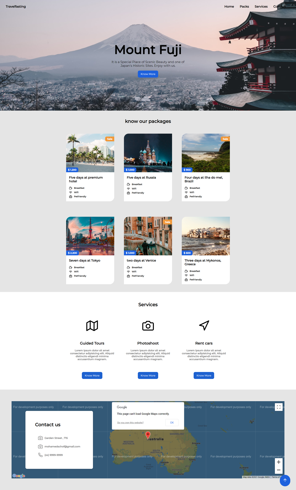

<h1 align="center">
Agency Travel Site 
</h1>

## 📋 Sumary

- [About](#-About)
- [Technologies](#-Technologies)
- [Preview](#-Website-Preview)

## 📖 About

This is a project for an Agency Travel Website.

Nice things that could be learned from this project:
 - Flexbox concepts
 - How to integrate with google maps
 - The site contact section uses a map to show the address, for that we used google maps integration and documentation.
 - Media queries
 ** All the site is responsive for smartphones, tablets and desktops. **

## 🚀 Technologies:

- HTML5
- CSS3
- JavaScript

## 🚀 Website Preview

  

